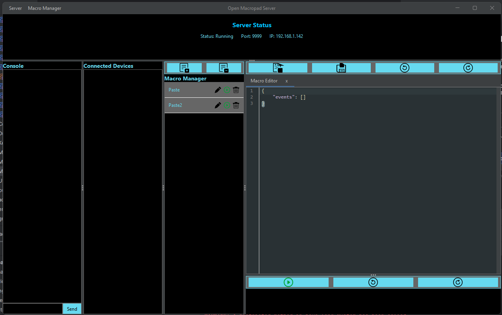

# Open Macropad Server

A server application for the Open Macropad device, allowing users to record, manage, and execute macros.

## Features

*   **Modern Dark Theme**: The entire application uses the FlatLaf dark theme for a clean, modern look and feel.
*   **SVG Icons**: All toolbars and buttons now use scalable SVG icons for a sharp, high-DPI-friendly interface.
*   **Macro Management**: Create, save, edit, and delete macros through a user-friendly interface.
*   **Live Directory Watching**: The macro manager automatically updates when you add, remove, or change macro files on disk.
*   **Editable Tab Titles**: Double-click a tab's title to rename it for better organization.
*   **Intelligent Saving**: The application intelligently handles "Save" and "Save As" operations, using the tab title as a suggested filename and preventing accidental overwrites.
*   **Batch Deletion**: Easily select and delete multiple macros at once.
*   **Always-On Macro Triggers**: Activate macros with a global hotkey, even when the application is not in focus. The trigger can be a single key or a combination of keys (e.g., Ctrl+Alt+T).
*   **Dynamic Font Sizing**: The text on macro items will dynamically resize to ensure all information is visible, even for long key combinations.

## UI Structure

The user interface is built using Java Swing and is organized into several key components:

*   **`Main.kt`**: The main entry point of the application. It initializes the FlatLaf Look and Feel, sets up the main window, menu bar, and assembles all the different UI panels into a nested layout using `JSplitPane`.

*   **`ServerStatusUI.kt`**: A panel at the top of the window that displays the server's status (running/stopped), IP address, and port.

*   **`ConsoleUI.kt`**: A panel that provides a console for viewing server messages, client connections, and for sending raw data to connected devices.

*   **`ConnectedDevicesUI.kt`**: A panel that lists all the clients currently connected to the server.

*   **`MacroManagerUI.kt`**: A powerful panel for managing your macros. It lists all available `.json` files from the macro directory (`Documents/OpenMacropadServer/Macros` by default). From here, you can:
    *   **Activate**: Toggle a macro to be always-on and listen for its global hotkey trigger.
    *   **Edit**: Open a macro in a new tab.
    *   **Delete**: Remove a single macro (with confirmation).
    *   **Batch Delete**: Enter a selection mode to remove multiple macros at once.

*   **`TabbedUI.kt`**: A container that holds different editor views in tabs. Each tab has a close button and an editable title.
    *   **`MacroJsonEditorUI.kt`**: The primary tab, which provides a syntax-highlighted text editor for viewing and editing the JSON structure of a macro. It uses the `RSyntaxTextArea` library with a dark theme. It also contains the `MacroBar`.
    *   **`MacroBar.kt`**: A visual representation of the macro's steps, displayed as a sequence of items (`MacroKeyItem`, `MacroMouseItem`). It also features a toolbar with "Record", "Undo", and "Redo" buttons, as well as a dedicated slot for the macro's trigger.

*   **Toolbars**: The application features several toolbars with SVG icons for quick access to common actions:
    *   **Macro Manager Toolbar**: "Add" and "Remove" buttons for managing macros.
    *   **Editor Toolbar**: "Save", "Save As", "Undo", and "Redo" buttons for the active editor tab.

## Technical Notes

*   **JNativeHook Modifier Keys**: The global hotkey functionality relies on the `JNativeHook` library. To ensure reliable detection of modifier keys (Ctrl, Alt, Shift), the `ActiveMacroManager` checks for the integer literals of the left and right modifier keys (e.g., `29` for Left Ctrl, `157` for Right Ctrl) as the named constants (e.g., `VC_CONTROL_L`) were found to be unavailable in the current environment.

